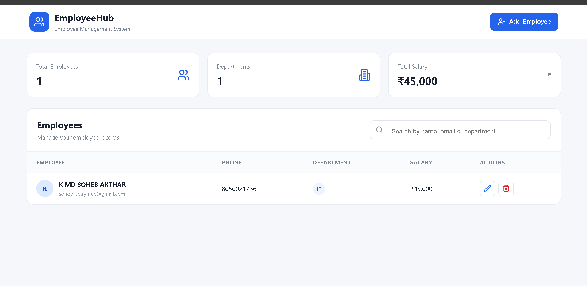

# Employee Management System

A full-stack Employee Management System built using Java 21, Spring Boot, MySQL, and React.js.

## 🚀 Features

- Add new employees
- View all employees
- Update employee details
- Delete employees
- Search employees by name, email, or department
- Dashboard with employee statistics
- Department count
- Total salary calculation
- RESTful APIs
- MySQL database integration
- Responsive React user interface

## 🛠️ Technologies Used

### Backend
- Java 21
- Spring Boot
- Spring Data JPA
- Hibernate
- REST API
- Maven

### Frontend
- React.js
- JavaScript
- HTML5
- CSS3
- Vite

### Database
- MySQL

### Tools
- Visual Studio Code
- MySQL Workbench
- Git
- GitHub
- Thunder Client / REST API testing

## 📂 Project Structure

```text
employee-management-system-java21/
│
├── backend/
│   ├── src/
│   │   └── main/
│   │       ├── java/
│   │       │   └── com/example/employee
│   │       └── resources/
│   │           └── application.properties
│   └── pom.xml
│
├── frontend/
│   ├── src/
│   │   ├── App.jsx
│   │   ├── api.js
│   │   ├── main.jsx
│   │   └── styles.css
│   ├── package.json
│   └── vite.config.js
│
├── .gitignore
├── JAVA-VERSION.txt
└── README.md

```text
employee-management-system-java21/
│
├── backend/
│
├── frontend/
│
├── .gitignore
├── JAVA-VERSION.txt
└── README.md
```

## 📸 Application Screenshot

### Employee Dashboard



## 🔗 API Endpoints

| Method | Endpoint | Description |
|--------|----------|-------------|
| GET | `/api/employees` | Get all employees |
| GET | `/api/employees/{id}` | Get employee by ID |
| POST | `/api/employees` | Add a new employee |
| PUT | `/api/employees/{id}` | Update employee |
| DELETE | `/api/employees/{id}` | Delete employee |

## ▶️ How to Run the Project

### 1. Clone the Repository

```bash
git clone https://github.com/SohebAkthar/employee-management-system.git
cd employee-management-system
```

### 2. Start the Backend

Open a terminal:

```bash
cd backend
mvn spring-boot:run
```

Backend will run on:

```text
http://localhost:8080
```

### 3. Start the Frontend

Open another terminal:

```bash
cd frontend
npm install
npm run dev
```

Frontend will run on:

```text
http://localhost:5173
```

### 4. Open the Application

Open your browser and visit:

```text
http://localhost:5173
```

### 5. Database Configuration

Make sure MySQL is running and the `employee_db` database exists.

Update the MySQL username and password in:

```text
backend/src/main/resources/application.properties
```

## 🗄️ Database

The application uses MySQL with the following employee table:

| Column | Type | Description |
|--------|------|-------------|
| id | BIGINT | Primary key |
| name | VARCHAR | Employee name |
| email | VARCHAR | Employee email |
| phone | VARCHAR | Employee phone number |
| department | VARCHAR | Employee department |
| salary | DOUBLE | Employee salary |

Database name:

```text
employee_db
